## 1. 準備 
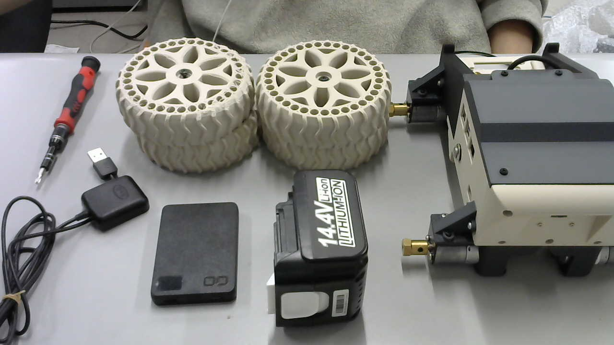
	内容物
	- 本体 
	- ホイール x4
	- M4ネジ x4
	- ワッシャー x4
	- マキタ互換バッテリー
	- CIOモバイルバッテリー
	- GPS USBタイプ
	組み立てに必要なもの
	- M4プラスドライバー
	- (M2.5 6角)
## 2. モバイルバッテリーの挿入
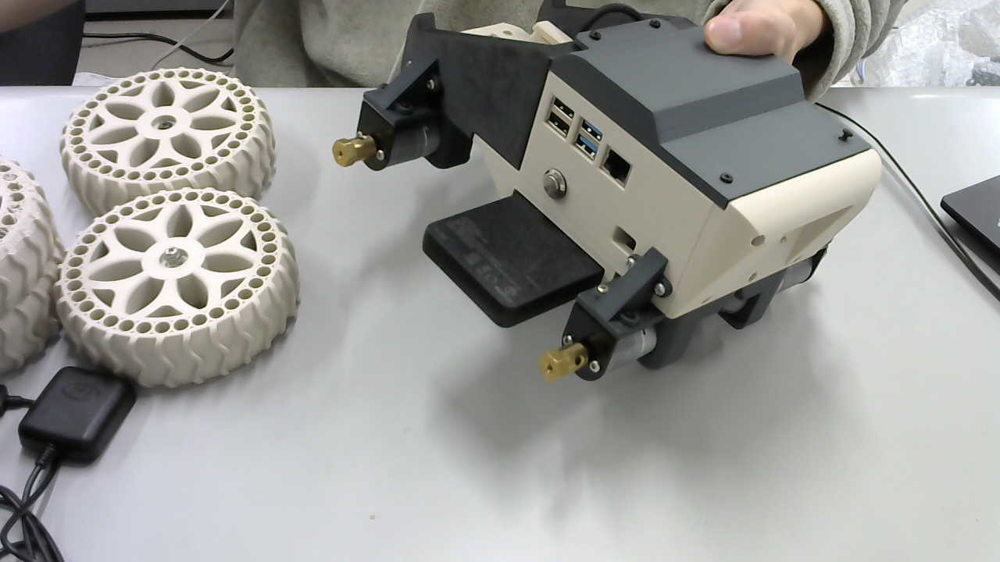
	下のスペースにモバイルバッテリーを**下向きに**挿入する．
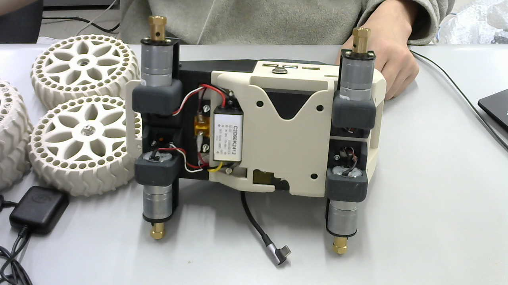
	バッテリー容量が確認できるモニターがちょうど見えるようになるはず．
## 3. ホイールの取付
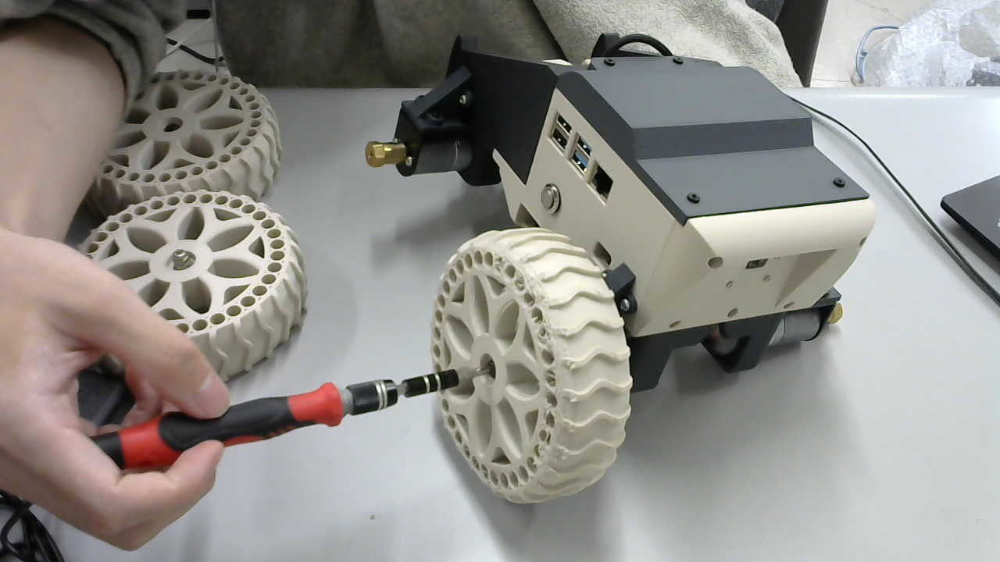
	ネジの頭とホイールの間にワッシャーを挟む
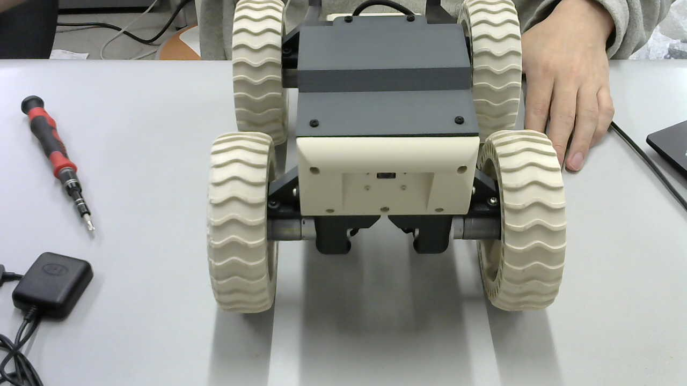
	左右でホイールのパターンをそろえたほうがいい
## 4. GPSの取付
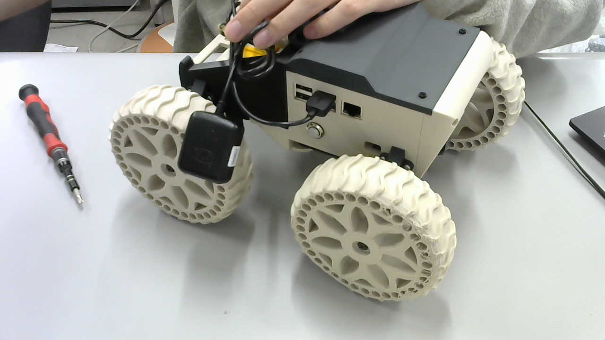
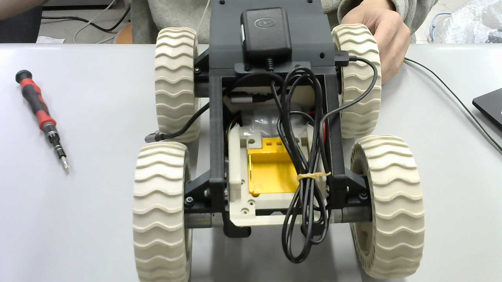
	現状GPSの取付スペースがないので，ケーブルの間に通して固定する
## 5. モーター用バッテリーの挿入
	挿入の前に，本体側面の**ボタンが押下されていない**ことを確認

	バッテリーの溝に合わせてスライドするように挿入する．
	カチッと言うまでバッテリーを押し込む．
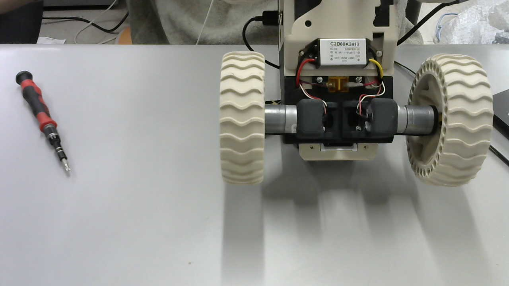
	白い部分がバッテリー取付スペースの穴から完全に出れば固定できている．
## 6. 電源投入
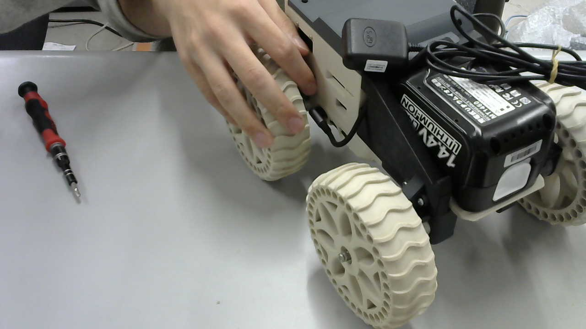
	TypeCコネクタをモバイルバッテリーに差し込む．
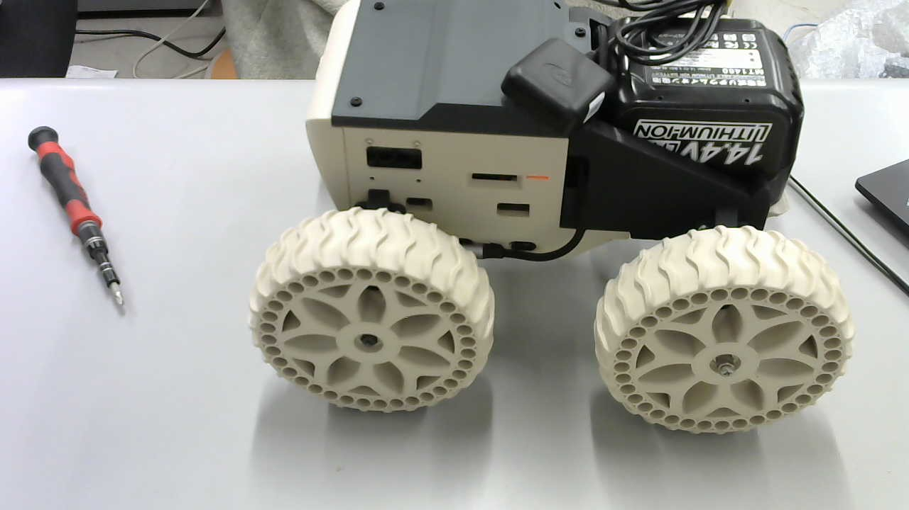
	赤いランプが点灯することを確認
## 7. システム起動の確認 
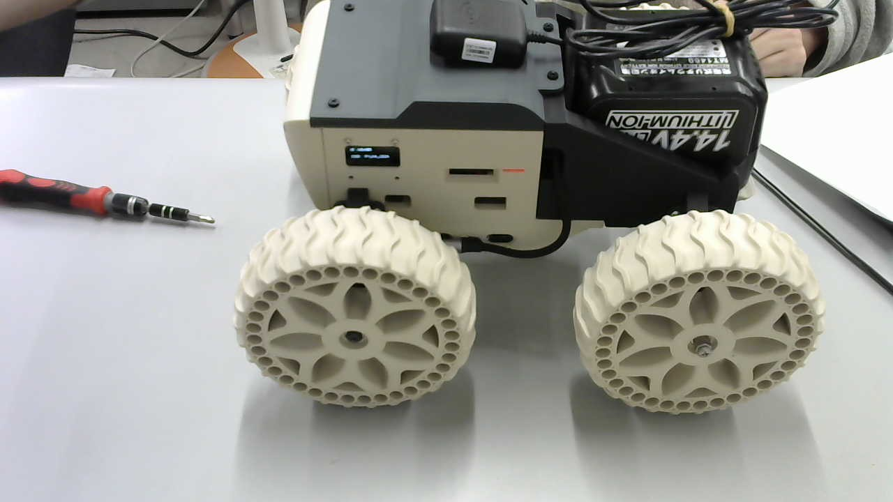
	電源投入後，5分ほどするとモニターにIDと現在接続されているWifiのSSIDが表示される．
	システムが正常に起動したことを示す．
## 8. モーター用スイッチの押下

	
