## このドキュメントについて

教材用ロボット **GritCat** を、**箱から出して動かせる状態にするまで**の手順書です。

- **対象**：本教材を運営するスタッフ
  開発者向けの構築手順（Raspberry Pi へのOS書き込み、ROS 2 のインストール等）は別紙 [GritCat Raspberry pi セットアップ手順.md](https://github.com/foqhn/ekagaku_gritcat/blob/main/%E8%AA%AC%E6%98%8E%E7%94%A8/GritCat%20Raspberry%20pi%20%E3%82%BB%E3%83%83%E3%83%88%E3%82%A2%E3%83%83%E3%83%97%E6%89%8B%E9%A0%86.md) を参照してください。
- **所要時間の目安**：30〜40分（1台あたり。2台目以降はPC側設定が不要なため10分程度）
- **到達点**：ブロックプログラミング画面にロボットが `Connected` と表示される状態

---

## 0. 準備するもの

### 同梱されているもの

- GritCat 本体
- ホイール ×4
- M4ネジ・ワッシャー（ホイール固定用、小袋入り）
- マキタ互換バッテリー（駆動用）
- バッテリー充電器
- LANケーブル（白・ストレート）
- GPSモジュール USBタイプ

### スタッフが用意するもの

- **PC**（LANポート付きが望ましい。無ければUSB-LAN変換アダプタ）
- **M4用プラスドライバー**
- **会場のWi-Fi情報**（SSID とパスワード）
- インターネットに接続できるネットワーク環境
- LANケーブル（同梱されていない場合）

> ⚠️ **ロボットの個体番号を最初に確認してください。**
> コンテナの蓋・本体に貼られた番号（例：`07`）が、ロボットID（`robot07`）および
> 有線接続時のIPアドレスに対応します。複数台を同時にセットアップする場合は取り違えに注意。

---

## 1. 開封・内容物の確認

### 1-1. コンテナを確認する

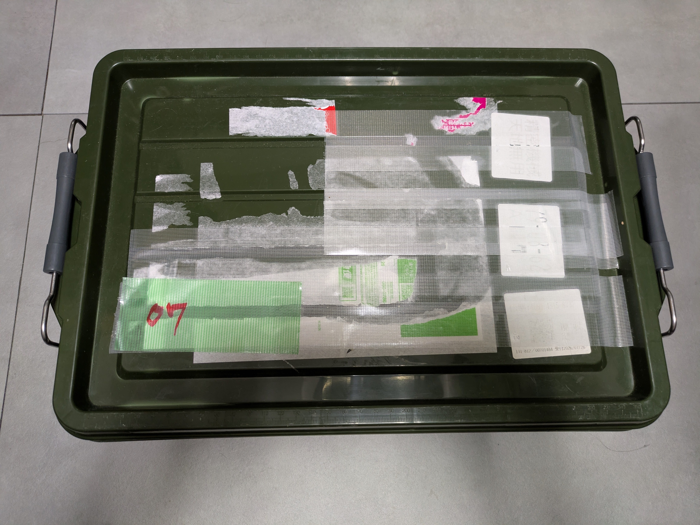

蓋に貼られたラベルの番号が、この中に入っているロボットの個体番号です。
**この番号を控えてから**開封してください。

### 1-2. 蓋を開ける

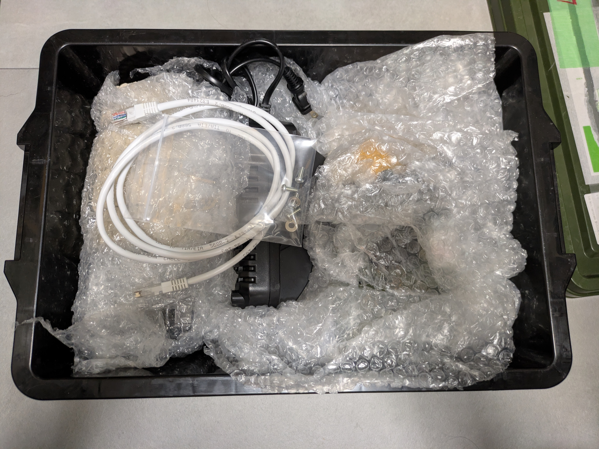

本体・付属品は緩衝材に包まれています。返却時に再利用するので、**緩衝材は捨てずに取っておいてください。**

### 1-3. 内容物を並べて確認する

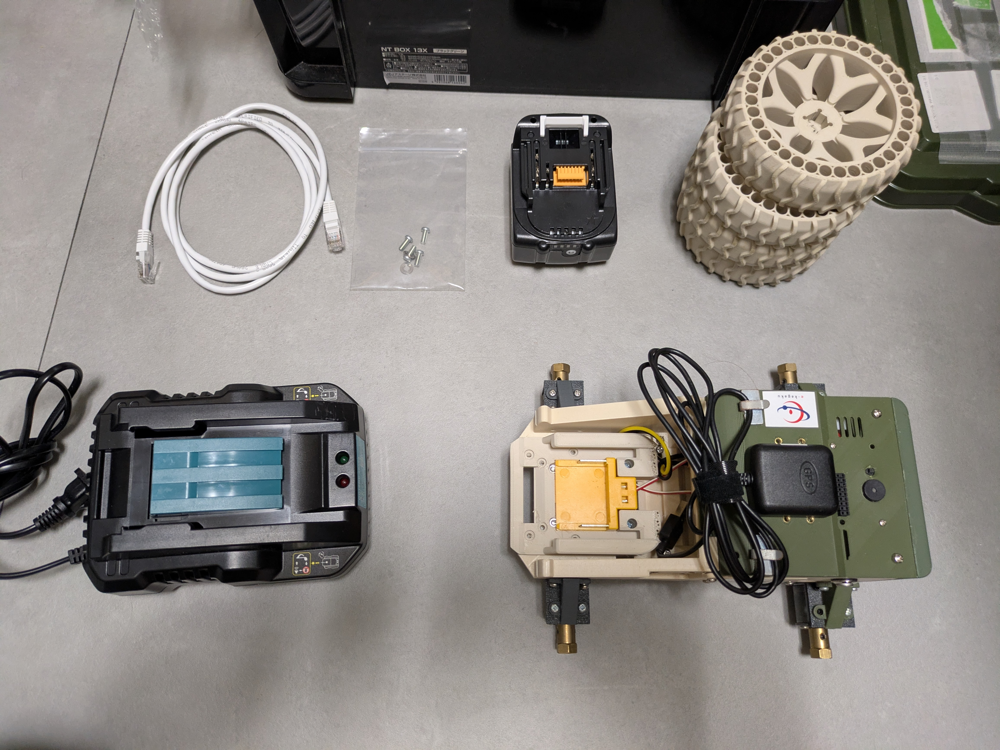

| 品目                 | 数量 | 備考                 |
| -------------------- | ---- | -------------------- |
| GritCat 本体         | 1    | GPSユニット取付済み  |
| ホイール             | 4    | 3Dプリント製         |
| M4ネジ・ワッシャー   | 一式 | 小袋入り。予備を含む |
| マキタ互換バッテリー | 1    | 14.4V。駆動用        |
| バッテリー充電器     | 1    |                      |
| LANケーブル          | 1    | 初期設定用           |

不足があればこの時点で報告してください。

---

## 2. ホイールの取付

### 2-1. ホイールをモーターシャフトに差し込む

ホイール中央の穴を、モーターシャフト（6角形）に合わせて差し込みます。

### 2-2. M4ネジで固定する

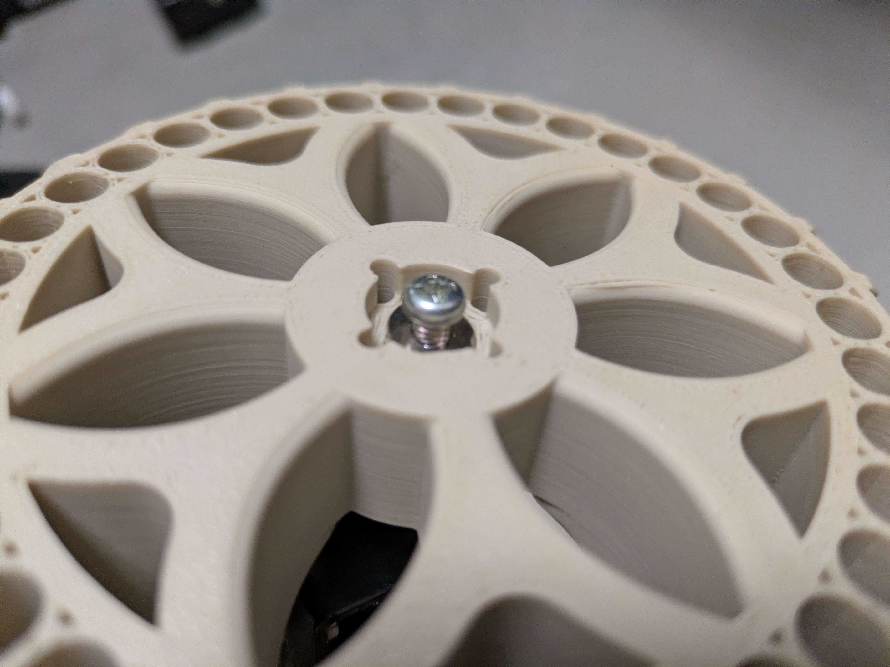

ホイール中央のくぼみにネジを通し、プラスドライバーで締め込みます。

**4輪すべて**同じ手順で取り付けてください。

> 💡 左右でホイールのトレッドパターン（溝の向き）を揃えると見栄えが良くなります。

### 2-3. 取付完了の確認

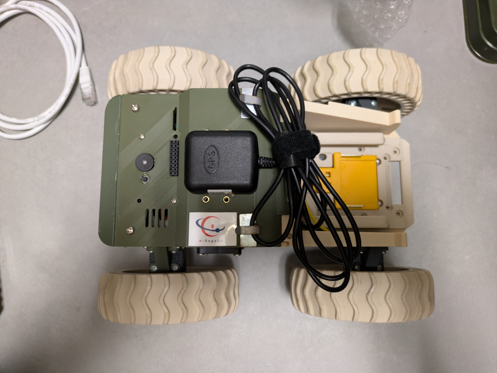

4輪が取り付けられた状態です。

- ホイールを手で回して、**ガタつきや空回りがない**ことを確認

---

## 3. 駆動用バッテリーの装着

### 3-1. バッテリーを差し込む

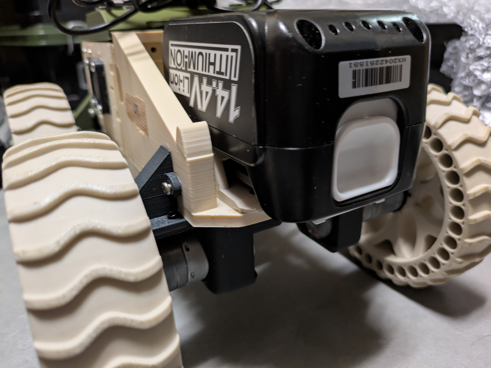

本体後方のバッテリーホルダーに、**バッテリーの溝をレールに合わせてスライドさせる**ように差し込みます。

**カチッと音がするまで**押し込んでください。

### 3-2. 装着完了を確認する

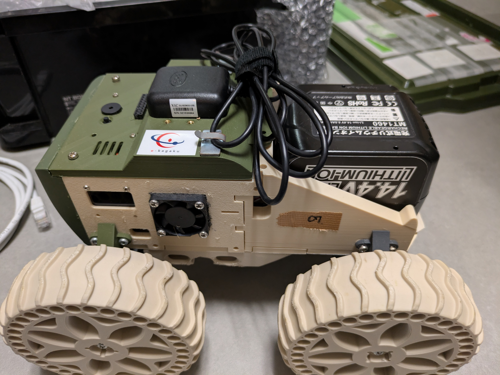

バッテリーが奥まで入り、ロックされた状態です。

軽く引っ張っても抜けないことを確認してください。

> ⚠️ バッテリー残量が少ないとモーターが動きません。

> 残量が不安な場合は、**先に充電器で充電**してから装着してください。

---

## 4. 電源投入

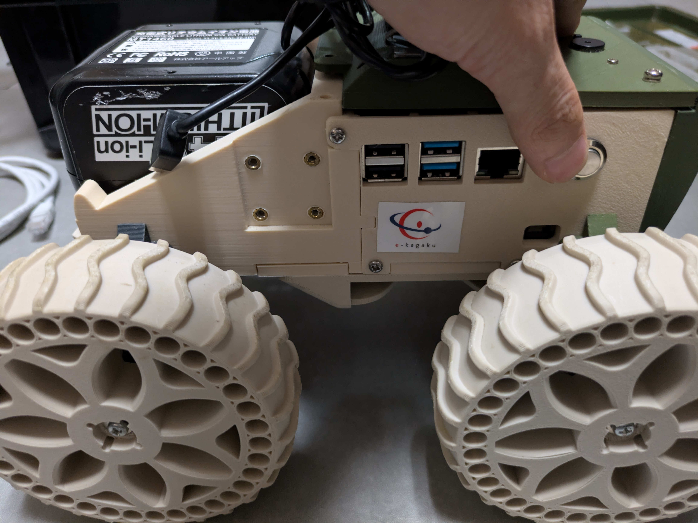

本体**背面パネル右側の丸いボタン**を押します。

背面パネルには左から USB端子・LANポート・電源ボタン が並んでいます。

押すとシステムの起動が始まります。

---

## 5. システム起動の確認

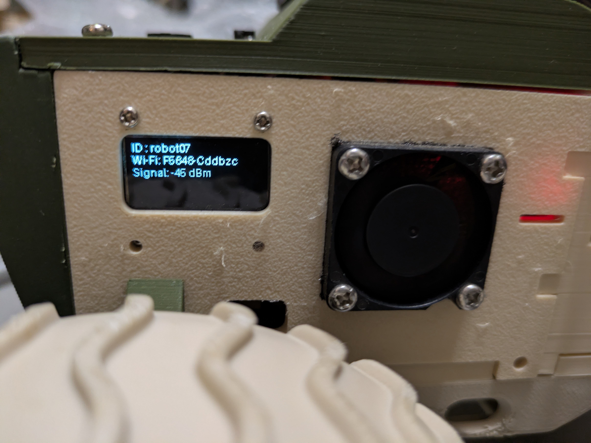

電源投入から**数分（最大5分程度）**待つと、本体側面のOLEDモニタに以下が表示されます。

```
ID     : robot07
Wi-Fi  : F5848-Cddbzc
Signal : -46 dBm
```

| 表示     | 意味                                                                 |
| -------- | -------------------------------------------------------------------- |
| `ID`     | このロボットの識別名。ブロックプログラミング画面で選択する名前と同じ |
| `Wi-Fi`  | 現在接続中のWi-Fi（SSID）                                            |
| `Signal` | 電波強度。`-70 dBm` より悪い場合は接続が不安定になりやすい           |

**この表示が出ればシステムは正常に起動しています。**

- **会場のWi-Fiがすでに表示されている場合** → 手順 6〜9 を飛ばして、**手順 10** へ進んでください。

- **Wi-Fi欄がN/A、または別のSSIDが表示されている場合** → 続けて手順 6 以降でWi-Fiを登録します。

---

## 6. PCと有線で接続する

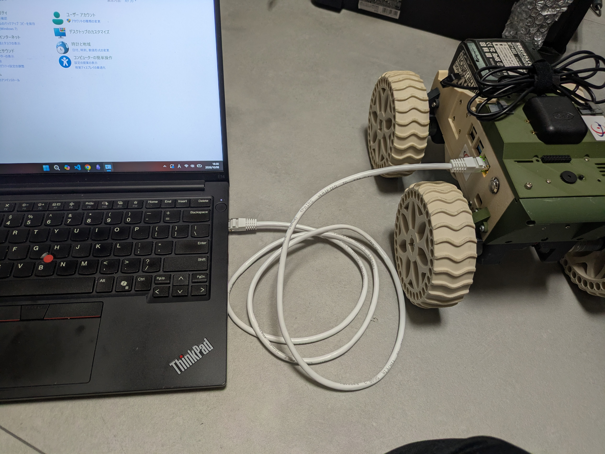

付属のLANケーブルで、**ロボット背面のLANポート**と**PCのLANポート**を直結します。

> Wi-Fi設定を書き換えるための一時的な接続です。設定が終われば取り外します。

---

## 7. PCのイーサネットに固定IPを設定する

> この設定は**PC1台につき最初の1回だけ**で構いません。2台目以降のロボットでは省略できます。

### 7-1. コントロールパネル →「ネットワークとインターネット」

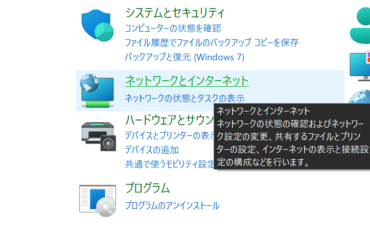

### 7-2.「ネットワークと共有センター」

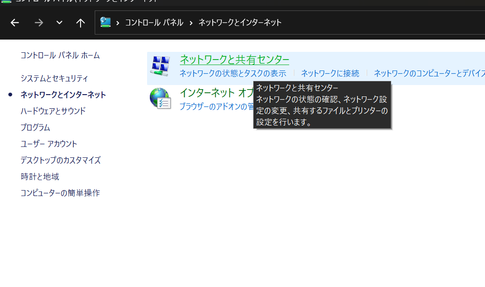

### 7-3.「アダプターの設定の変更」

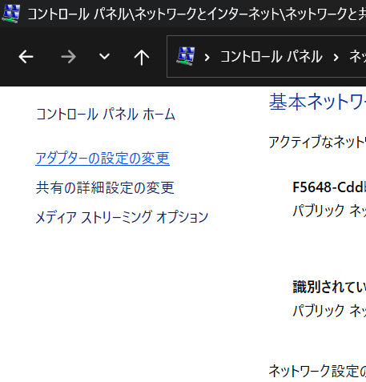

### 7-4. ロボットを繋いだ「イーサネット」を選ぶ

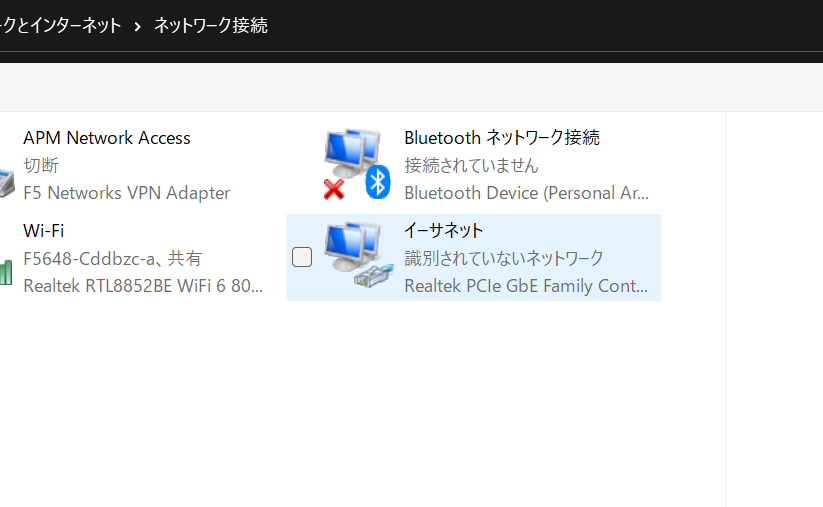

複数のアダプターが並んでいます。**Wi-Fi ではなく「イーサネット」**を選んでください。

### 7-5. 右クリック →「プロパティ」

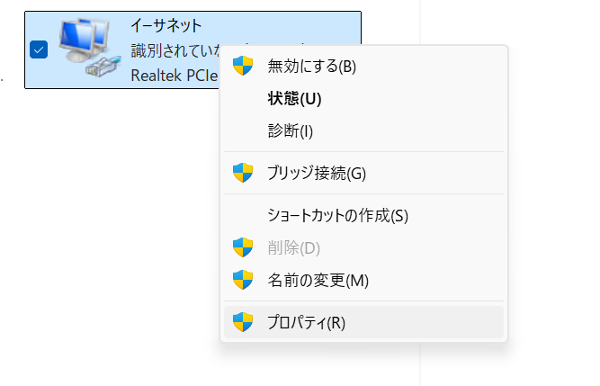

### 7-6.「インターネット プロトコル バージョン 4 (TCP/IPv4)」を選び「プロパティ」

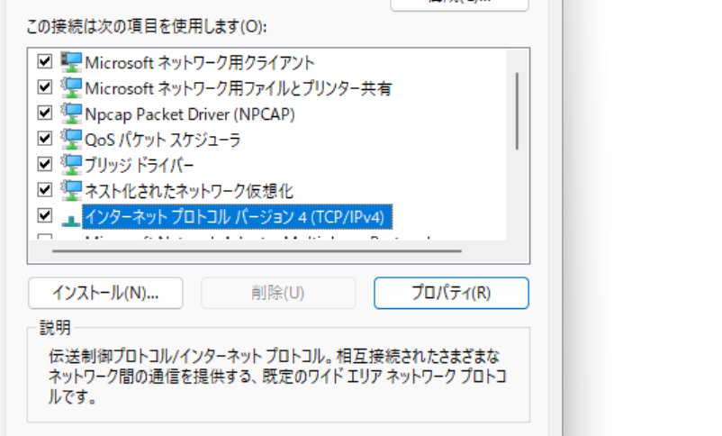

### 7-7. 固定IPを入力する

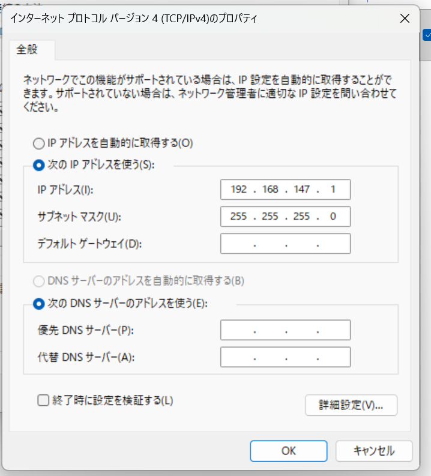

「次の IP アドレスを使う」を選び、以下のとおり入力します。

| 項目                    | 入力値          |
| ----------------------- | --------------- |
| IP アドレス             | `192.168.147.1` |
| サブネット マスク       | `255.255.255.0` |
| デフォルト ゲートウェイ | **空欄のまま**  |
| DNS サーバー            | **空欄のまま**  |

入力したら「OK」→「閉じる」。

### 7-8. 設定が反映されたか確認する

コマンドプロンプトを開いて以下を実行し、`192.168.147.1` になっていることを確認します。

```
ipconfig
```

---

## 8. 設定画面でWi-Fiを登録する

PCのブラウザで、ロボットの設定画面を開きます。

```
http://192.168.147.<ロボットに割り当てられたアドレス>:8080
```

> **`<ロボットに割り当てられたアドレス>` はロボットごとに異なります。ロボットリストを参照してください。**

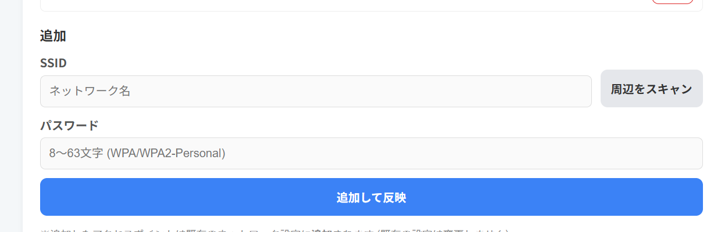

「追加」欄に会場のWi-Fi情報を入力します。

1. **SSID** … ネットワーク名を入力。分からない場合は「**周辺をスキャン**」で一覧から選択

2. **パスワード** … 8〜63文字（WPA/WPA2-Personal）

3. 「**追加して反映**」をクリック

> 💡 複数の会場を回る場合、過去に登録したWi-Fiは残ります。電波が届く方に自動で接続されます。

---

## 9. システムを再起動する

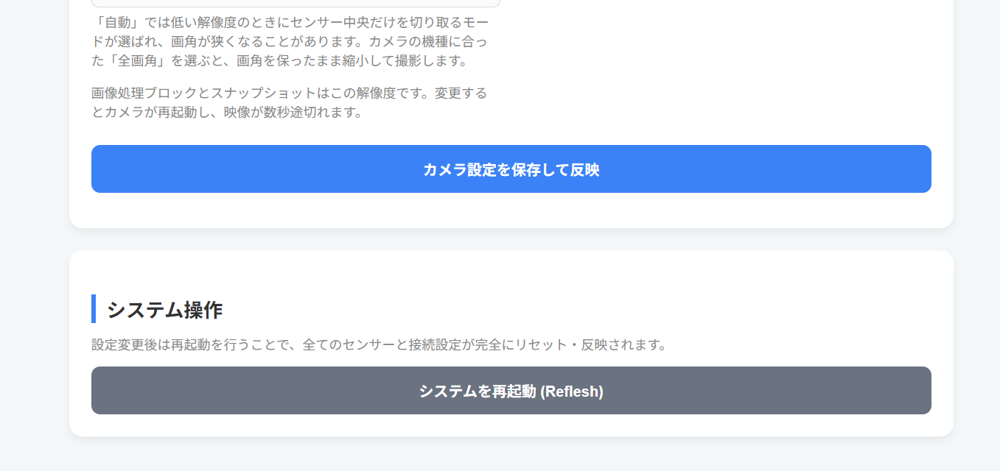

同じ設定画面を下へスクロールし、「**システム操作**」の

「**システムを再起動 (Reflesh)**」をクリックします。

再起動後、**本体側面のOLEDモニタに、登録した会場のSSIDが表示されること**を確認してください。

表示されればWi-Fi接続は成功です。

確認できたら、**LANケーブルを抜いて**ください。

---

## 10. ブロックプログラミング画面から接続する

PCを**会場のWi-Fi（ロボットと同じネットワーク）**に接続し、ブラウザで以下を開きます。

```

https://gritcat.e-kagaku.com/

```

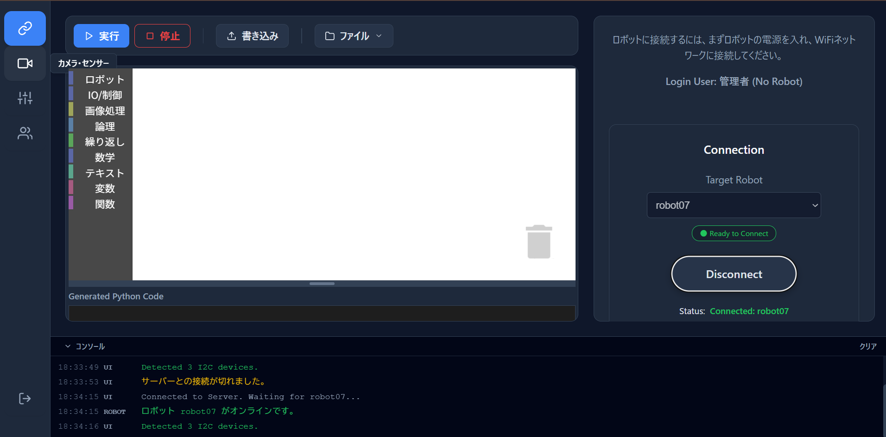

画面右側の **Connection** パネルで操作します。

1. **Target Robot** のプルダウンから、該当するロボットID（例：`robot07`）を選択

2. `● Ready to Connect` と表示されることを確認

3. **Connect** をクリック

4. 下部に `Status: Connected: robot07` と表示されれば接続完了

コンソールに `ロボット robot07 がオンラインです。` と出れば、**セットアップは完了**です。

ブロックを並べて「実行」すれば、ロボットが動きます。

---

## 11. トラブルシューティング

### 電源を入れてもOLEDモニタが点かない

- 駆動用バッテリーが**奥までロックされているか**確認（手順 3-2）

- バッテリー残量が空の可能性 → 充電器で充電

- 背面の電源ボタンをもう一度しっかり押す

- それでも点かない場合は開発担当へ連絡

### OLEDは点くが `Wi-Fi` 欄が空／別のSSIDが出る

- 会場のWi-Fiが未登録です。**手順 6〜9** をやり直してください

- SSID・パスワードの打ち間違いがないか確認（特に大文字小文字）

- `Signal` が `-75 dBm` より悪い場合は、ルーターに近い場所で再試行

### ブラウザで設定画面（`192.168.147.x:8080`）が開けない

- `ipconfig` でPCのイーサネットが `192.168.147.1` になっているか確認

- LANケーブルが両端ともしっかり挿さっているか確認

- **IPの末尾の番号が、そのロボットのものか**確認（ロボットリスト）

- PCのWi-Fiを一時的にオフにして再試行（経路が競合することがあります）

### Target Robot のプルダウンに出てこない

- OLEDに会場のSSIDが表示されているか確認（表示されていなければWi-Fi未接続）

- **PCとロボットが同じWi-Fi**に繋がっているか確認

- ロボットを再起動（電源ボタン／設定画面の「システムを再起動」）して1〜2分待つ

### 接続はできるがモーターが動かない

- 駆動用バッテリーの残量を確認（RaspberryPiは動いていてもモーター電源が落ちていることがあります）

- バッテリーのロックを確認し、一度抜き差しする

- ホイールのネジの緩み・空回りを確認

---

## 12. 片付け・返却手順

1. ブロックプログラミング画面で **Disconnect** をクリックし、接続を切る

2. 本体の電源を切る
      電源ボタンを押してシャットダウン
3. 駆動用バッテリーを取り外す

   - ロック解除ボタンを押しながら、スライドさせて引き抜く

   - **返却前に充電器で満充電**にしておく

4. ホイールを外す（M4ネジを緩めて引き抜く）

5. 本体・付属品を**緩衝材に包み直し**、LANケーブル・充電器・ネジ袋と一緒にコンテナへ収納

6. **コンテナのラベル番号と、中のロボットの個体番号が一致している**ことを確認して蓋を閉じる

7. 破損・紛失・不具合があれば、個体番号を添えて開発担当へ報告

---

## 付録：用語とアドレス早見表

| 項目                       | 値                                          |
| -------------------------- | ------------------------------------------- |
| PC側 固定IP（有線設定時）  | `192.168.147.1` / `255.255.255.0`           |
| ロボット設定画面           | `http://192.168.147.<個体ごとの番号>:8080`  |
| ブロックプログラミング画面 | `https://gritcat.e-kagaku.com/`             |
| ロボットID                 | OLEDモニタの `ID` 欄に表示（例：`robot07`） |
